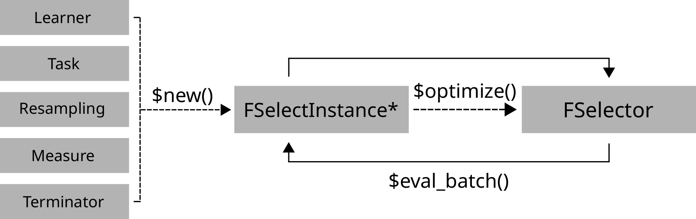

```{r, include=FALSE}
library(mlr3)
library(mlr3fselect)
library(data.table)
```

## Class Overview
The package provides a set of R6 classes which allow to (a) define generalfeature selection instances and (b) run algorithms which optimize on these.
(a) is called a FSelectInstanceSingleCrit or FSelectInstaneMultiCrit, which define a blackbox optimization function that maps feature subsets to resampled performance values for arbitrary performance measures.
							



## Terminators - When to stop

Construction: `trm`(.key, ...)`

* `evals` (`n_evals`) <br> After a given amount of iterations.
* `clock_time` (`secs`, `stop_time`) <br> After a given absolute time.
* `model_time` (`secs `) <br> After a given training time.
* `perf_reached` (`level`) <br> After a specific performance was reached.
* `stagnation` (`iters`, `threshold`) <br> After the performance stagnated for given iterations.
* `stagnation_batch` (`n`, `threshold`) <br> After the performance stagnated for given batches.

```{r, results='hide'}
as.data.table(mlr_terminators)
```

Lists all available terminators.

## FSelectInstance* - Search Scenario
					
Evaluator and container for resampled performances of feature subsets.
The main (internal) function `eval_batch(xdt)` calls `benchmark()` to evaluate a table of feature subsets. 
Also stores archive of all evaluated feature subsets and the final result.

```{r, include=FALSE}
task = tsk("iris")
learner = lrn("classif.rpart")
resampling = rsmp("holdout")
measure = msr("classif.ce")
terminator = trm("evals", n_evals = 20)
```

```{r, results='hide'}
instance = FSelectInstanceSingleCrit$new(
  task, learner, resampling, measure,
  terminator)
```

Set `store_benchmark_result = TRUE` to store resamplings of evaluations and `store_models = TRUE` to store associated models.

```{r, results='hide', class.source='example'}
instance = FSelectInstanceSingleCrit$new(
    tsk("iris"), lrn("classif.rpart"), rsmp("cv"), msr("classif.ce"), 
    trm("evals", n_evals = 10))
fselector = fs("random_search")
fselector$optimize(instance)
```

Use `FSelectInstanceMultiCrit` for multi-criteria tuning.

## FSelector - Search Strategy
						
Feature Selection strategy. 
Generates feature subsets and passes these to `FSelectInstance*` for evaluation until termination.

Creation: `fs(.key, ...)`
						
* `random_search` (`batch_size`) <br> Random search.
* `exhaustive_search` (`max_features`) <br> Exhaustive Search.
* `sequential` (`strategy`) <br> Sequential Selection.
* `rfe` (`feature_fraction`, `recursive`) <br> Recursive Feature Elimination.
* `design_points` (`batch_size `, `design`) <br> User supplied feature subsets.
						
```{r, results='hide'}
as.data.table(mlr_fselectors)
```

Lists all available feature selection algorithms.
				
## Executing the Feature Selection

```{r, results='hide'}
fselector$optimize(instance)
```
							
Starts the feature selection. `FSelector` generates feature subsets and passes these to the `$eval_batch()` method of the `FSelectInstance*` until the budget of the `Terminator` is exhausted.
							
```{r, results='hide'}
instance$archive$data()
```
							
Returns all evaluated feature subsets and their resampling results.
							
```{r, results='hide', class.source='example'}
instance$archive$data()
## >     Petal.Length Petal.Width Sepal.Length Sepal.Width classif.ce
## >  1:        FALSE       FALSE         TRUE       FALSE 0.26000000
## >  2:         TRUE       FALSE         TRUE       FALSE 0.08000000
```
							 
`uhash` refers to `instance$archive$benchmark_result`.
						
```{r, results='hide'}
instance$result
```

Returns data.table with optimal feature subset and estimated performance.
							
```{r, results='hide'}
task$select(instance$result_feature_set)
```

Set optimized feature subset in `Task`.

## AutoFSelect - Select before Train

Wraps learner and performs integrated feature selection.
						
```{r, results='hide'}
at = AutoFSelect$new(
  learner, resampling, measure, terminator, 
  fselector)
```
						
Inherits from class `Learner`.
Training starts feature selection on the training set.
After completion the learner is trained with the "optimal" feature subset on the given task.

```{r, include=FALSE}
row_ids = 1:50
```

```{r, eval = FALSE}
at$train(task)
at$predict(task, row_ids)
```
					
## Nested Resampling

Resampling the `AutoFSelect` results in nested resampling with an inner and outer loop.
							
```{r, results='hide', class.source='example'}
resampling_inner = rsmp("holdout")
evals20 = trm("evals", n_evals = 20)

at = AutoFSelect$new(learner, resampling_inner, measure, evals20, fselector) 
at$store_fselect_instance = TRUE

resampling_outer = rsmp("cv", folds = 2)
rr = resample(task, at, resampling_outer, store_models = TRUE)

as.data.table(rr)
## >              learner         resampling iteration              prediction
## > 1: <AutoFSelect[38]> <ResamplingCV[19]>         1 <PredictionClassif[19]>
## > 2: <AutoFSelect[38]> <ResamplingCV[19]>         2 <PredictionClassif[19]>
```
						
```{r, results='hide'}
rr$aggregate()
```

Aggregates performances of outer folds.
							
```{r, results='hide'}
as.data.table(rr)$learner[[1]]$fselect_result
```

Retrieves inner feature selection results.

## Logging and Parallelization

```{r, eval=FALSE}
lgr::get_logger("bbotk`")$set_threshold("<level>")`
```

Change log-level only for mlr3fselect.

```{r, eval=FALSE}
future::plan(strategy)
```

Sets the parallelization backend.
Speeds up feature selection by running iterations in parallel.


