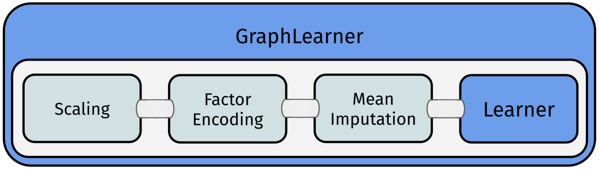
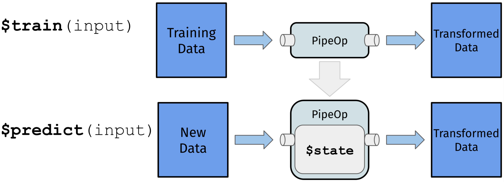
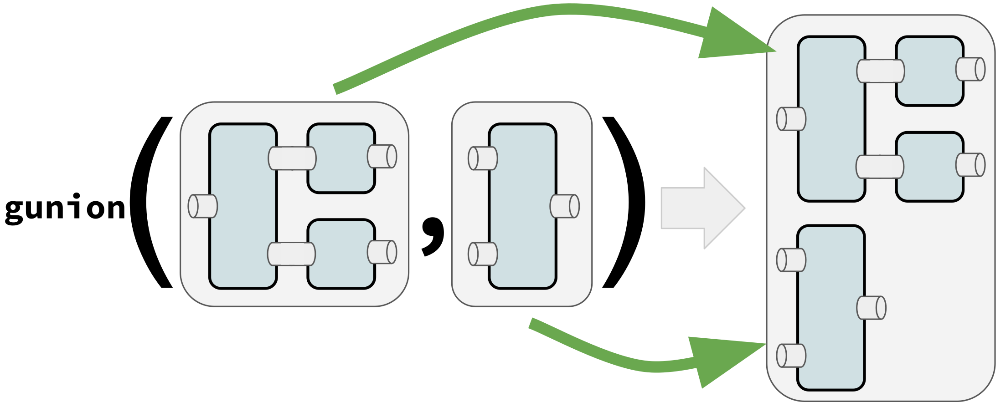
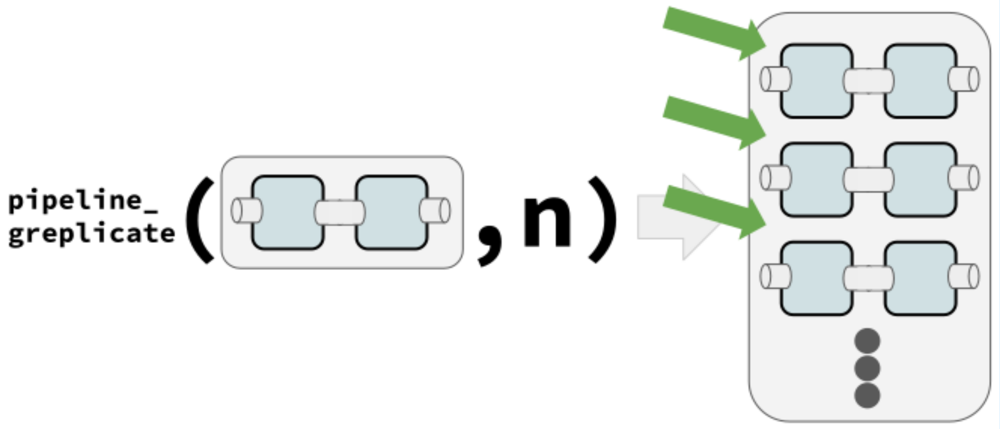

```{r, include=FALSE}
library(mlr3)
library(mlr3pipelines)
```

## Introduction
 
Combine ML operations to flexible pipelines and processing graphs, which can be configured trained, resampled, tuned as any regular learner.
The main purpose of a `Graph` is to build combined preprocessing and model fitting pipelines that can be used as a `Learner`.


             
Each operation in the above example is a `PipeOp` which transforms the data in each step. `PipeOp`s are chained with the `%>>%` operator.
            
## PipeOp

Flow operation with `$train()` and `$predict()` step.



Construction example: `pca = po`("pca")`

* $train(input): Named list
* $predict(input): Named list
* $state: Learned parameters
* $param_set: See hyperparameters


## Popular PipeOps

| Class                 | Key               | Operation             |
|-----------------------|-------------------|-----------------------|
| PipeOpRemoveConstants | "removeconstants" | Repair Tasks          |
| PipeOpScale           | "scale"           | Scale Features        |
| PipeOpImputeMean      | "impute"          | Impute NAs            |
| PipeOpFilter          | "filter"          | Feature Filter        |
| PipeOpEncode          | "encode"          | Factor Encoding       |
| PipeOpPCA             | "pca"             | PCA                   |
| PipeOpSelect          | "select"          | Restrict Columns      |
| PipeOpColApply        | "colapply"        | Transform Columns     |
| PipeOpClassBalancing  | "classbalancing"  | Imbalanced Data       |
| PipeOpLearner         | "learner"         | Use Learner           |
| PipeOpLearnerCV       | "learner_cv"      | Crossval Learner      |
| PipeOpMutate          | "mutate"          | Fearure Engineering   |
| PipeOpChunk           | "chunk"           | Split Data            |
| PipeOpSubsample       | "subsample"       | Subsample Rows        |
| PipeOpFeatureUnion    | "featureunion"    | Combine Features      |
| PipeOpFixFactors      | "fixfactors"      | Handle Unknown Levels |
| PipeOpNOP             | "nop"             | Do Nothing            |

 Full list: `as.data.table(mlr_pipeops)`

## Graph

Connects `PipeOp`s with edges to control data flow during training and prediction. Input is sent to sources (no in-edges), output is read from sinks (no out-edges).
              
Important methods and slots:

* Display: `print`(gr)`, `gr$plot`(html = TRUE)`
* Accessing `PipeOp`s: `gr$pipeops` <br> Named list of all contained POs.


## Graph Construction

The `%>>%` operator takes either a `PipeOp` or a `Graph` on each of its sides and connects all left-hand outputs to the right-hand inputs.
          
 For full control, connect `PipeOp`s explicitly:

```{r, eval=FALSE}
gr = Graph$new()
gr$add_pipeop(po("pca"))
gr$add_pipeop(lrn("classif.rpart"))
gr$add_edge("pca", "classif.rpart")
```

## GraphLearner
              
`GraphLearner` behave like `Learner` and enable all mlr3 features : `grl = GraphLearner`$new(gr)`
See slots `$encapsulate` for debugging and `$model` for results after training.
          
## Linear Graphs
              
Concatenate POs with `%>>%`:
              

```{r, eval=FALSE, class.source='example'}
gr = po("scale") %>>% po("encode") %>>%
  po("imputemean") %>>% lrn("classif.rpart")
grl = GraphLearner$new(gr)
# access the scale pipeop:
grl$graph$pipeops$scale
grl$train(task)
grl$model
grl$predict(task)
rr = resample(task, grl, rsmp("cv", folds = 3))
```

## Hyperparameters

For POs: Exactly as in a `Learner`.
              
```{r, eval=FALSE}
enc = po("encode") 
enc$param_set
enc$param_set$values = list(method="one-hot") 
po("encode", param_vals = list(method="one-hot"))
```
              
For `Graph` / `GraphLearner`: All HPs are collected in a global ParamSet stored in `$param_set`.
IDs are prefixed with the respective `PipeOp`'s `id`.
             
## Tuning
             
Can jointly tune any Pipeline.        
             
```{r, eval=FALSE, class.source='example'}
gr = po("encode") %>>% lrn("classif.rpart")
grl = GraphLearner$new(gr)
tune_ps = ParamSet$new(list(
  ParamFct$new("encode.method",
    levels = c("one-hot", "poly")),
  ParamDbl$new("classif.rpart.cp",
    lower = 0, upper = 0.05)
))
tt = trm("evals", n_evals = 20)
rs = rsmp("holdout")
inst = TuningInstanceSingleCrit$new(task, grl, rs,
  msr("classif.ce"), tune_ps, tt)
tuner = tnr("random_search")
tuner$optimize(inst)
```

Usage of `AutoTuner` is identical.

## Feature Engineering

`PipeOpMutate` adds new features.
This works by providing expressions in a `list`.
              
```{r, eval=FALSE, class.source='example'}
task = tsk("iris")
mutations = list(
  Sepal.Sum = ~ Sepal.Length + Sepal.Width)
mutate = po("mutate", param_vals =
  list(mutation = mutations))
GraphLearner$new(mutate %>>% lrn("classif.rpart"))
```

## Nonlinear Graphs

`gunion`()` arranges `PipeOp`s or `Graph`s next to each other in a disjoint graph union.
              

              
`pipeline_greplicate()` creates a new `Graph` containing `n` copies of the input (`PipeOp` or `Graph`).
              

             
`PipeOpFeatureUnion` aggregates features from all input tasks into a single `Task`.
              
        
```{r, eval=FALSE, class.source='example'}
# train on orig and pca features
gunion(list(po("nop"), po("pca"))) %>>%
  po("featureunion") %>>% lrn("classif.rpart")
```

```{r, eval=FALSE, class.source='example'}
pr = po("subsample") %>>% lrn("classif.rpart")
bagging = ppl("greplicate", pr, n = 10) %>>%
  po("classifavg", innum = 10)
```

## Branching

Controls the path execution.
Only one branch can be active.
Which one is controlled by a hyperparameter.
Unbranching ends the forking.
              
             
```{r, eval=FALSE, class.source='example'}
gr = ppl("branch", list(
  pca = po("pca"), scale = po("scale"))
)
# set the "pca" path as the active one:
gr$param_set$values$branch.selection = "pca"`
```
              
Tuning the branching selection enables powerful model selection.
            