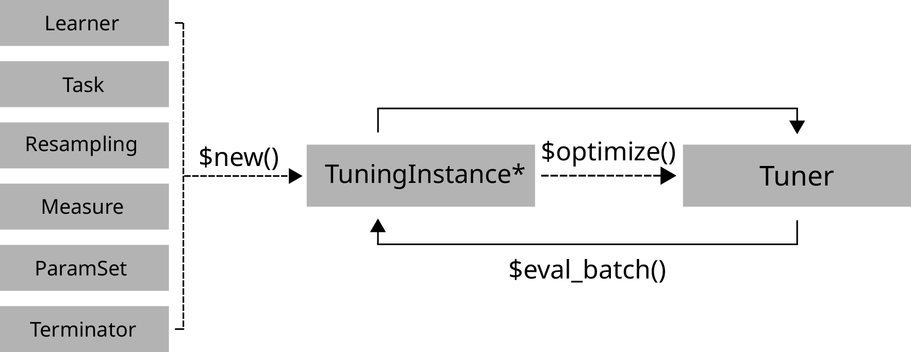

```{r, include=FALSE}
library(mlr3)
library(mlr3tuning)
library(mlr3learners)
library(data.table)
library(paradox)
```

## Class Overview

The package provides a set of R6 classes which allow to (a) define general hyperparameter (HP) tuning instances and (b) run algorithms which optimize on these. 
(a) is called a TuningInstanceSingleCrit or TuningInstaneMultiCrit, which define a blackbox optimization function that maps HP candidate configurations to resampled performance values for arbitrary performance measures.



## ParamSet - Parameters and Ranges

Scalar doubles, integers, factors or logicals are combined to define a multivariate tuning space.

```{r, eval=FALSE}
tune_ps = ParamSet$new(list(
  ParamInt$new(id, lower, upper),
  ParamDbl$new(id, lower, upper),
  ParamFct$new(id, levels),
  ParamLgl$new(id)))
```

`id` is the Param identifier. `lower`/`upper` define numerical ranges, `levels` is for categories.
							
							
### Transformations for Rescaling

```{r, eval=FALSE}
tune_ps$trafo = function(x, param_set) {
x$id =  2^{x$id}; return(x)}
```

Apply a custom transformation before passing the param to the `Learner.
							
### Parameter Dependencies
							
Dependencies prevent invalid learner configurations.
							
```{r, eval=FALSE}
tune_ps$add_dep(id, on, cond)
```

Adds a dependency for param `id` so that param `id` depends on param `on`, optional to condition `cond`.

## Terminators - When to stop

Construction: `trm(.key, ...)`

* `evals` (`n_evals`)<br> After a given amount of iterations.
* `clock_time` (`secs`, `stop_time`)<br> After a given absolute time.
* `model_time` (`secs `)<br> After a given training time.
* `perf_reached` (`level`)<br> After a specific performance was reached.
* `stagnation` (`iters`, `threshold`)<br> After the performance stagnated for given iterations.

```{r, results='hide'}
as.data.table(mlr_terminators)
```

Lists all available terminators.

## TuningInstance* - Search Scenario

Evaluator and container for resampled performances of HP configurations during tuning.
The main (internal) function `eval_batch(xdt)` calls `benchmark()` to evaluate a table of HP configurations.

Also stores archive of all evaluated experiments and the final result.

```{r, include=FALSE}
task = tsk("iris")
learner = lrn("classif.rpart")
resampling = rsmp("holdout")
measure = msr("classif.ce")
terminator = trm("evals", n_evals = 20)

tune_ps = ParamSet$new(list(
  ParamDbl$new("cp", lower = 0.01, upper = 0.4)
))
```

```{r, results='hide'}
instance = TuningInstanceSingleCrit$new(
  task, learner, resampling, measure,
  tune_ps, terminator)
```
Set `store_benchmark_result = TRUE` to store resamplings of evaluations and `store_models = TRUE` to store associated models.

```{r, results='hide', class.source='example'}
# optimize hyperpar of RBF SVM on logscale
learner = lrn("classif.svm", kernel = "radial",
  type = "C-classification")
    
tune_ps = ParamSet$new(list(
  ParamDbl$new("cost", lower = -8, upper = 8),
  ParamDbl$new("gamma", lower = -8, upper = 8)))
tune_ps$trafo = function(x, param_set) {
  x$cost = 2^x$cost; x$gamma = 2^x$gamma; x}
evals20 = trm("evals", n_evals = 20)
    
instance = TuningInstanceSingleCrit$new(
  task, learner, resampling, measure, tune_ps, 
  evals20)
tuner = tnr("random_search")
tuner$optimize(instance)
instance$result
```

Use `TuningInstanceMultiCrit` for multi-criteria tuning.

## Tuner - Search Strategy

Tuning strategy. 
Generates candidate configurations and passes these to `TuningInstance` for evaluation until termination.
Creation: `tnr(.key, ...)`

* `grid_search` (`resolution`, `batch_size`) <br> Grid search.
* `random_search` (`batch_size`) <br> Random search.
* `gensa` (`smooth`, `temperature`) <br> Generalized Simulated Annealing.
* `nloptr` (`algorithm`) <br> Non-linear optimization.
* `design_points` (`batch_size `, `design`) <br> User supplied settings.

```{r, results='hide'}
as.data.table(mlr_tuners)
```
Lists all available tuners.

## Executing the Tuning

```{r, results='hide'}
tuner$optimize(instance)
```

Starts the tuning. `Tuner` generates candidate configurations and passes these to the `$eval_batch()` method of the `TuningInstance*` until the budget of the `Terminator` is exhausted.

```{r, results='hide'}
instance$archive$data()
```

Returns all evaluated configurations and their resampling results.
Use `unnest` to display HP with (`x_domain`) trafo applied.
							
```{r, results='hide', class.source='example'}
instance$archive$data()
## >     cost gamma classif.ce   x_domain batch_nr
## > 1:  3.13  5.55       0.56  <list[2]>        1
## > 2: -1.94  1.32       0.10  <list[2]>        2
```

`uhash` refers to `instance$archive$benchmark_result`.

```{r, results='hide'}
instance$result
```

Returns list with optimal configurations and estimated performance.
							
```{r, results='hide'}
learner$param_set$values = 
  instance$result_learner_param_vals
```

Set optimized HP in `Learner`.

## AutoTuner - Tune before Train

Wraps learner and performs integrated tuning.
							
```{r, results='hide'}
at = AutoTuner$new(
  learner, resampling, measure, tune_ps, 
  terminator, tuner)
```

Inherits from class `Learner`.
Training starts tuning on the training set.
After completion the learner is trained with the "optimal" configuration on the given task.

```{r, include=FALSE}
row_ids = 1:50
```

```{r, results='hide'}
at$train(task)
at$predict(task, row_ids)
```

## Nested Resampling

Resampling the `AutoTuner` results in nested resampling with an inner and outer loop.
							
```{r, results='hide', class.source='example'}
resampling_inner = rsmp("holdout")

at = AutoTuner$new(learner, resampling_inner, 
  measure, tune_ps, evals20, tuner,
  store_tuning_instance = TRUE) 
									
resampling_outer = rsmp("cv", folds = 2)
rr = resample(task, at, resampling_outer, 
  store_models = TRUE)
									
as.data.table(rr)
## >             learner         resampling iteration  
## > 1:  <AutoTuner[37]> <ResamplingCV[19]>         1
## > 2:  <AutoTuner[37]> <ResamplingCV[19]>         2
```

```{r, results='hide'}
rr$aggregate()
```

Aggregates performances of outer folds.
							
```{r, results='hide'}
as.data.table(rr)$learner[[1]]$tuning_result
```

Retrieves inner tuning results.

## Logging and Parallelization

```{r, eval=FALSE}
lgr::get_logger("bbotk")$set_threshold("<level>")
```

Change log-level only for mlr3tuning.

```{r, eval=FALSE}
future::plan(strategy)
```

Sets the parallelization backend.
Speeds up tuning by running iterations in parallel.
